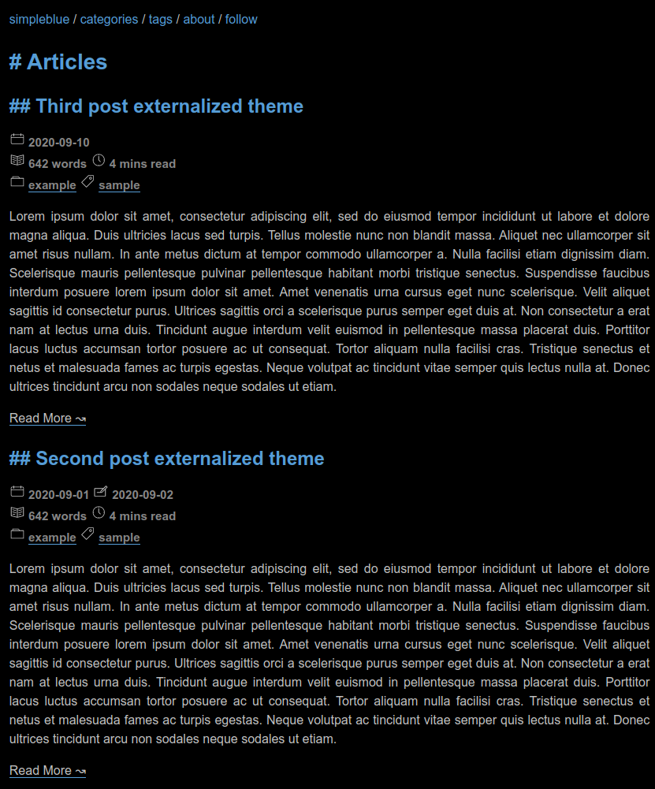

# simpleblue theme for Zola

This is a simple theme for Zola based on dark colours and blue tones.

## Example



## Contents

- [Installation](#installation)
- [Requirements](#requirements)
- [Configuration](#configuration)
  - [Top navigation links](#top-navigation-links)
  - [Author](#author)
- [References](#references)

## Installation

First download this theme to your `themes` directory:

```ShellSession
$ cd themes
$ git clone https://github.com/jeduardo/simpleblue-theme-zola.git
```

Then enable the theme in your `config.toml`:

```toml
theme = "simpleblue"
```

## Requirements

This theme requires your index section (`content/_index.md`) to be paginated to work:

```toml
paginate_by = 5
```
O
The posts should therefore be in directly under the `content` folder.

The theme requires tags and categories taxonomies to be enabled in your `config.toml`:

```toml
taxonomies = [
    # You can enable/disable RSS
    {name = "categories", rss = true},
    {name = "tags", rss = true},
]
```

If you want to paginate taxonomies pages, you will need to overwrite the templates as it only works for non-paginated taxonomies by default.

This theme supports hiding pages from showing up in any listing. The implementation requires that every page has an attribute `hidden` specified in its header section, as below:

```toml
title = "About me"
in_search_index = false
weight = 0

[extra]
hidden = true
```

## Configuration

### Top navigation links

Set a field in `extra` with a key of `nav_links`:

```toml
[extra]
nav_links = [
  { url = "$BASE_URL/categories/", name = "Categories"},
  { url = "$BASE_URL/tags/", name = "Tags"},
  { url = "$BASE_URL/atom.xml", name = "Follow"}
]
```

If you put `$BASE_URL` in a url, it will automatically be replaced by the actual site URL.

### Author

The theme displays the author name at the bottom of the layout. For it to work, add the `author` attribute to the `extra` section of `config.toml`, as below:

```toml
[extra]
author = "Website Author"
```

## References

This theme was created from scratch but heavily drawing ideas, macros, and snippets from the [After Dark](https://github.com/getzola/after-dark) and [anpu](https://github.com/zbrox/anpu-zola-theme) themes, and I am grateful for the work and permissive licenses from their authors.

The SVG icons are used from an [icon pack from Bryn Taylor](https://dribbble.com/shots/1934932-77-Essential-Icons-Free-Download).
